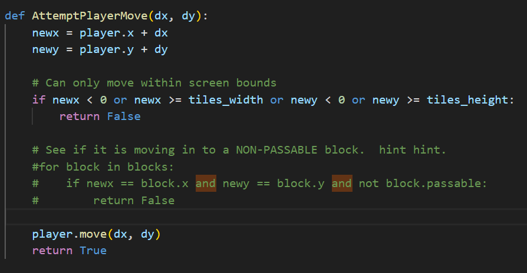
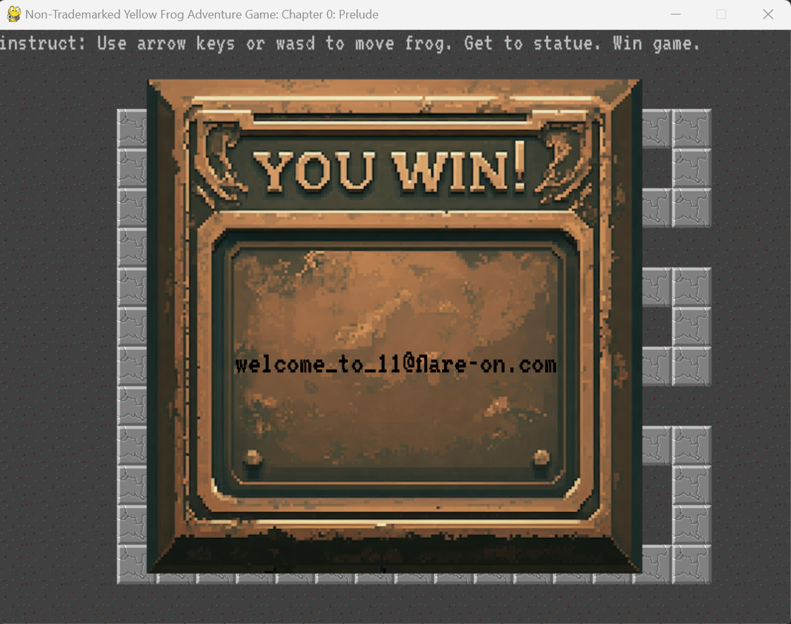

In the first challenge we are given a simple python game.  In this case aswell as the source code

You have to get the frog to the to center to get the flag. As you can see its completely closed off and the collision detection prevents us from getting there. 
in the Python source code I simply commented out the collision detection. Moved to the center and got the flag!😎

