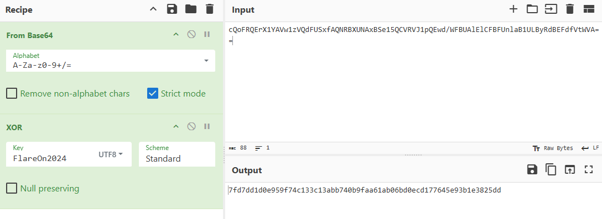
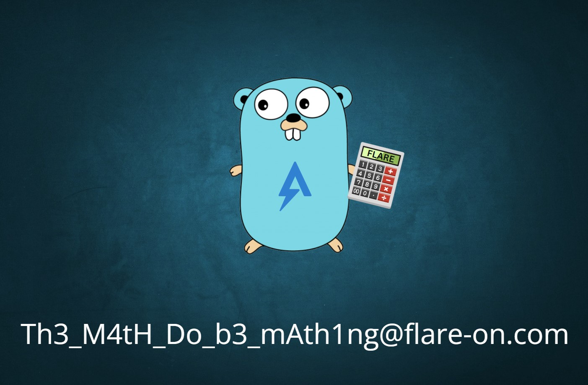

We are given a Golang exe. Running the exe, it prompts a user to do a bunch of math problems (3 to 8 times) and then asks the user to input a certain checksum value, which will unlock the image (the flag).

opened it up in Ghidra and noticed an important function that is main.a. 
I had to rely mostly on the assembly code when analyzing it, as the decompiled code was a bit messed up.What main.a does is that it first XORs an input string with a constant string, ***FlareOn2024***. 
It then encodes the XOR'ed string to base64 and compares it with another string: ***cQoFRQErX1YAVw1zVQdFUSxfAQNRBXUNAxBSe15QCVRVJ1pQEwd/WFBUAlElCFBFUnlaB1ULByRdBEFdfVtWVA==*** So to get the correct checksum to unlock the flag, we just have to reverse this. I just used CyberChef to do this.

Now just run the exe from the command line again, do the math problems, input the checksum value, and it should unlock an img in %LocalAppData%\REAL_FLAREON_FLAG.jpg.

