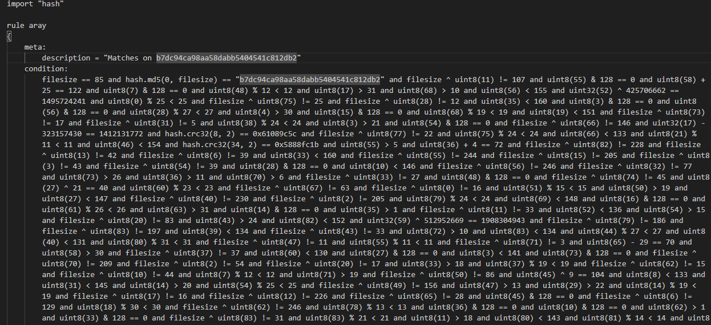
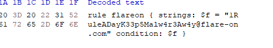

we given a YARA rule file. we have to create a file that matches the contitions of the YARA rules



 I first thought of scripting this out. Quickly realized it would be quicker to do it manually than figuring out how to code a script for it. I ended up using notepad, a hex editor and a calculator. I would say most of the conditions are redundant so it actually didn't take that long to do all the calculations . I grouped up the ones that gave definite answers first such as ...
 ```
 uint32(10) + 383041523 == 2448764514 ,
```
there were some Hash values as well that could easily be brute forced 
```
hash.md5(0, 2) == "89484b14b36a8d5329426a3d944d2983" ```
hash.crc32(78, 2) == 0x7cab8d64
```
I opened a hex editor and starting typing in each offset and watched how the flag formed!😉



