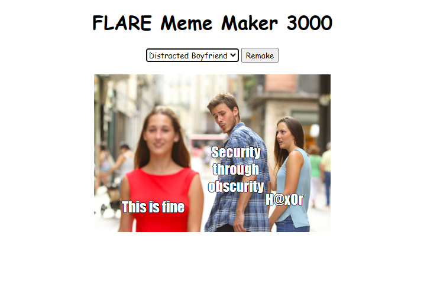
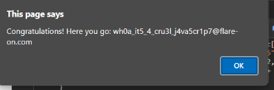

for challenge 4 we given a obfuscated javascript file. to deobfuscated it I used an online javascript deobfuscator.Made the code much easier to read.




looking through the function a0K I noticed this ***atob('Q29uZ3JhdHVsYXRpb25zISBIZXJlIHlvdSBnbzog')*** which is just a base64 encoded alert that decodes to "Congratulations! Here you go:".
This suggests that the f variable is resposible for the flag under the right conditions (a certain combination of meme and text reveals the flag).
we need specific values for four variables: a, b, c, and d.
```
At the top of the function, we see it returns early if a !== Object.keys(a0e)[5], which means a must match the value of Object.keys(a0e)[5]. This resolves to "boy_friend0.jpg".

The condition a0c.indexOf(b) == 14 tells us that b must be a0c[14], which is "FLARE On".

The condition a0c.indexOf(c) == a0c.length - 1 implies that c should be the last element in a0c, or a0c[a0c.length - 1], which is "Security Expert".

The last condition a0c.indexOf(d) == 22 specifies that d must be a0c[22], which is "Malware".
```

once these values are set we should get the flag! I set these values in the devtools console but you could also just edit the code with the values.



